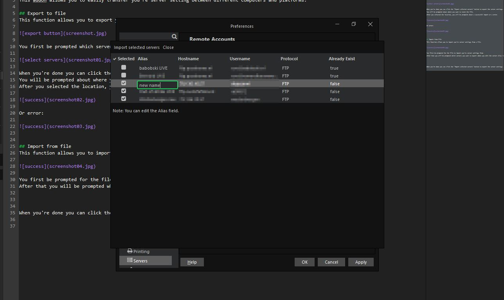

# Import and Export Servers

This addon allows you to easily transfer you're server setting between different computers and platforms.

## Export to file
This function allows you to export you're server settings to a file.

You first be prompted which servers you want to export (Note you edit the server alias in this screen).

When you're done you can click the "Export selected servers" button to export the server settings.  
You will be prompted about where you want to store the file.  
After you selected the location, you will be prompted about a successful export or a error.

Or error:

## Import from file
This function allows you to import you're server settings from a file.

You first be prompted for the file to import you're server settings from.    
After that you will be prompted which servers you want to export (Note you edit the server alias in this screen).  
You can only import server that not already exist.

When you're done you can click the "Import selected servers" button to export the server settings.  
After that you will be prompted about a successful import or a error.

Or error:

## Accessibility

The import and export function also available through the Tools menu:

## Roadmap

 * Encrypt/decrypt passwords
 * check if file already exist ( it now overwites the file )

