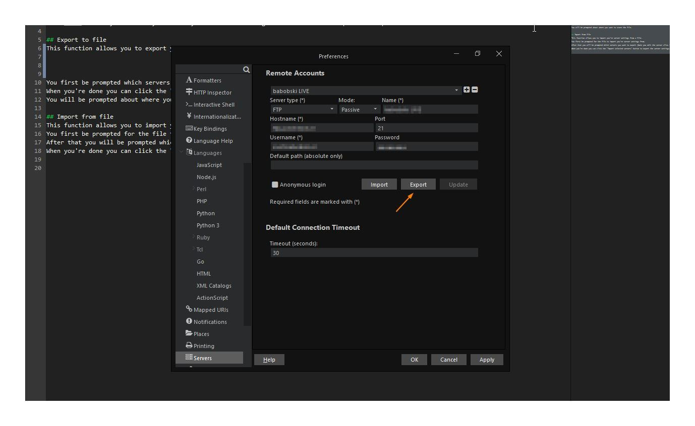

# Import Servers

Allows you to import you're server settings between major Komodo updates.  
Compatible with Komodo versions 9 - 11.

## Instructions
After install you will be prompted from witch Komodo version you want to import the server settings from (8.* - 11.*).

After making a selection and the imports are successful.  
You will be prompted to remove the addon and restart Komodo (to apply the changes).

